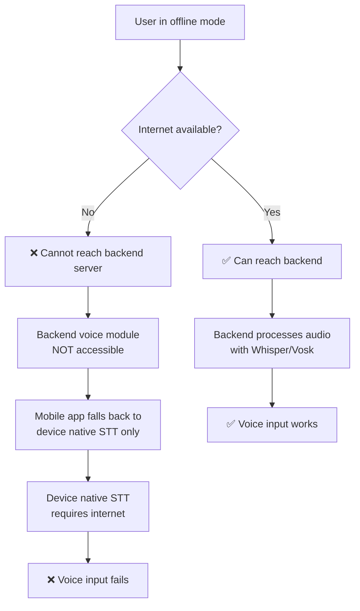

# Voice Assistant Offline Mode - Complete Explanation

## Question: Does the voice module work for all languages in offline mode?

### **Short Answer:** ⚠️ **Partially — with important limitations**

---

## Current Implementation Analysis

### 🎤 Speech-to-Text (STT) in Offline Mode

#### **Current Status: ❌ REQUIRES INTERNET for most devices**

**What the app uses:**
- Package: `speech_to_text` (Flutter plugin)
- Backend: Device's native speech recognition engine
  - **Android:** Google Speech Recognition API
  - **iOS:** Apple Speech Recognition

**Language Support Matrix:**

| Language | Code | STT Locale | Offline Support | Notes |
|---|---|---|---|---|
| **English** | `en` | `en-IN` | ⚠️ **Limited** | Some Android devices with Google Speech offline |
| **Hindi** | `hi` | `hi-IN` | ❌ **No** | Requires internet (Google servers) |
| **Nepali** | `ne` | `ne-NP` | ❌ **No** | Requires internet (Google servers) |
| **Bhojpuri** | `bho` | `hi-IN` (fallback) | ❌ **No** | Uses Hindi model, requires internet |

#### **Why Internet is Required:**

The `speech_to_text` package relies on:

1. **Android (Google Speech Recognition):**
   - Sends audio to Google Cloud servers for processing
   - Only English (`en-US`) has **limited** offline support on some devices
   - Indian languages (Hindi, etc.) **always require internet**
   - Offline language packs can be downloaded, but coverage is very limited

2. **iOS (Apple Speech Recognition):**
   - Processes audio on Apple servers
   - Offline support only for a few languages (primarily English)
   - Indian languages require internet connection

#### **What Happens When User Tries Voice Input Offline:**

```dart
// Current flow in chatbot_controller.dart (lines 216-265)

1. User taps microphone button
2. App calls speech_to_text.initialize()
3. speech_to_text tries to connect to native STT engine
4. Native engine tries to reach cloud servers
5. ❌ Error: "No internet connection"
6. User sees error message: "🎙️ Mic error: [error message]"
```

**Error behaviors:**
- **Android:** "Network error" or "No connection to speech service"
- **iOS:** "Recognition not available" or timeout

---

### 🔊 Text-to-Speech (TTS) in Offline Mode

#### **Current Status: ✅ WORKS OFFLINE for all languages**

**What the app uses:**
- Package: `flutter_tts` (Flutter plugin)
- Backend: Device's native TTS engine
  - **Android:** Google Text-to-Speech (local voices)
  - **iOS:** AVSpeechSynthesizer (local voices)

**Language Support Matrix:**

| Language | Code | TTS Locale | Offline Support | Voice Quality |
|---|---|---|---|---|
| **English** | `en` | `en-IN` | ✅ **Yes** | High (neural voices) |
| **Hindi** | `hi` | `hi-IN` | ✅ **Yes** | High (neural voices) |
| **Nepali** | `ne` | `ne-NP` | ✅ **Yes** | Medium (system voices) |
| **Bhojpuri** | `bho` | `hi-IN` (fallback) | ✅ **Yes** | High (uses Hindi voices) |

#### **How TTS Works Offline:**

```dart
// chatbot_controller.dart (lines 381-422)

1. Bot generates text response (offline chatbot)
2. App calls flutter_tts.speak(text)
3. TTS engine uses pre-installed voice packs on device
4. ✅ Speaks the text using local neural voices
5. No internet connection needed
```

**Voice packs are:**
- Pre-installed on most modern Android/iOS devices
- Can be downloaded from device Settings > Language > Text-to-Speech
- Stored locally on device storage (typically 50-200 MB per language)

---

## Architecture Comparison: Mobile App vs Backend

### Backend Voice Module (Python - **NOT USED in offline mode**)

The backend has a sophisticated voice module with true offline capabilities:

**File:** `backend/app/voice/stt_service.py`

```python
# Cascade system (lines from README):
# Tier 1: OpenAI Whisper (local) — Works OFFLINE
# Tier 2: Google Speech Recognition — Requires internet  
# Tier 3: Vosk — Works OFFLINE (lower accuracy)
```

**Backend offline capabilities:**
- ✅ Whisper model runs locally on server
- ✅ Supports multiple languages offline
- ✅ Vosk as fallback (fully offline)

**BUT: The mobile app does NOT use the backend voice module in offline mode!**

#### Why Mobile App Doesn't Use Backend Voice Module Offline:



---

## User Experience: What Actually Works Offline?

### Scenario 1: **Full Offline (No Internet)**

#### ✅ What Works:
- 📱 Opening Voice Assistant screen
- 👁️ UI animations (orb, waveform)
- 💬 Switching to text chat
- 🔊 **TTS (bot speaking responses)** — fully functional
- 💬 Typing text queries manually
- 🤖 Offline chatbot responses (100 topics)
- 🌍 All 4 languages (EN, HI, NE, BHO)

#### ❌ What Doesn't Work:
- 🎤 **Voice input (STT)** — microphone button shows error
- 🎙️ Speech recognition in any language
- 📡 Sending audio to backend for processing

**Error Message Shown:**
```
🎙️ Mic error: No internet connection
or
🎙️ Speech recognition not available on this device.
```

### Scenario 2: **Online Mode**

#### ✅ Everything Works:
- 🎤 Voice input (STT) — all 4 languages
- 🔊 Voice output (TTS) — all 4 languages
- 🤖 Full LLM-powered responses
- 📡 Backend voice processing (optional)

---

## Technical Root Cause

### Why `speech_to_text` Package Requires Internet:

Looking at the package documentation and Android/iOS behavior:

#### **Android (Google Speech Recognition):**
```java
// Under the hood (Android native code):
SpeechRecognizer recognizer = SpeechRecognizer.createSpeechRecognizer(context);
Intent intent = new Intent(RecognizerIntent.ACTION_RECOGNIZE_SPEECH);
intent.putExtra(RecognizerIntent.EXTRA_LANGUAGE_MODEL, 
                RecognizerIntent.LANGUAGE_MODEL_FREE_FORM);
intent.putExtra(RecognizerIntent.EXTRA_LANGUAGE, "hi-IN");

// This intent sends audio to Google Cloud Speech API (cloud-based)
// Only a few offline language packs are available and must be downloaded separately
recognizer.startListening(intent);
```

**Android Offline STT Requirements:**
1. User must manually download "Offline speech recognition" from Settings
2. Only available for limited languages:
   - English (US, UK, IN) — ✅ Available
   - Hindi — ⚠️ **NOT available offline** on most devices
   - Nepali — ❌ **NOT available offline**
3. Even when downloaded, quality is significantly lower than online

#### **iOS (Apple Speech Recognition):**
```swift
// Under the hood (iOS native code):
let recognizer = SFSpeechRecognizer(locale: Locale(identifier: "hi-IN"))
recognizer?.recognitionTask(with: request) { result, error in
    // This requires internet connection for most languages
    // Only English has partial offline support
}
```

**iOS Offline STT:**
- English: Limited offline support (iOS 13+)
- Hindi/Nepali: **Not available offline**

---

## Proposed Solutions

### Option 1: ⭐ **Recommended — Inform User Gracefully**

**Implementation:**

```dart
// In voice_chat_page.dart or chatbot_controller.dart

Future<void> _startListening() async {
  // Check internet connectivity BEFORE initializing STT
  final hasInternet = await _networkInfo.isConnected;
  
  if (!hasInternet) {
    // Show friendly message explaining limitation
    state = state.copyWith(
      voiceState: state.voiceState.copyWith(
        errorMessage: 
          '🌐 Voice input requires internet connection.\n\n'
          '💡 Tip: You can type your message instead, and the bot will '
          'still respond using the offline chatbot!',
      ),
    );
    
    // Optionally: Show a dialog with "Switch to Text Chat" button
    _showOfflineVoiceDialog();
    return;
  }
  
  // Proceed with normal STT initialization...
}

void _showOfflineVoiceDialog() {
  showDialog(
    context: context,
    builder: (context) => AlertDialog(
      title: Text('🎙️ Voice Input Unavailable'),
      content: Text(
        'Voice recognition requires an internet connection to work.\n\n'
        'The offline chatbot can still answer your questions if you type them!',
      ),
      actions: [
        TextButton(
          onPressed: () {
            Navigator.pop(context);
            // Switch to text chat
            Navigator.pushReplacement(
              context,
              MaterialPageRoute(builder: (_) => ChatPage()),
            );
          },
          child: Text('💬 Switch to Text Chat'),
        ),
        TextButton(
          onPressed: () => Navigator.pop(context),
          child: Text('OK'),
        ),
      ],
    ),
  );
}
```

**Pros:**
- ✅ Easy to implement (1-2 hours)
- ✅ Clear user communication
- ✅ Guides user to working alternative (text chat)
- ✅ No additional dependencies

**Cons:**
- ⚠️ Doesn't solve the underlying limitation

---

### Option 2: 🔧 **Advanced — Integrate On-Device STT (Whisper Flutter)**

**Use a fully offline STT package:**

Package: [`whisper_flutter`](https://pub.dev/packages/whisper_flutter) or [`vosk_flutter`](https://pub.dev/packages/vosk_flutter)

**Implementation Overview:**

```yaml
# pubspec.yaml
dependencies:
  whisper_flutter: ^0.3.0  # or vosk_flutter: ^0.4.0
```

```dart
// lib/features/medical_chatbot/services/offline_stt_service.dart

import 'package:whisper_flutter/whisper_flutter.dart';

class OfflineSttService {
  late Whisper _whisper;
  bool _initialized = false;

  Future<void> initialize() async {
    _whisper = Whisper.fromAsset("assets/models/whisper_base.bin");
    await _whisper.init();
    _initialized = true;
  }

  Future<String?> transcribeAudio(String audioFilePath, String language) async {
    if (!_initialized) await initialize();
    
    final result = await _whisper.transcribe(
      audioFilePath: audioFilePath,
      language: _mapLanguageCode(language), // "en", "hi", "ne"
    );
    
    return result?.text;
  }
  
  String _mapLanguageCode(String appCode) {
    const map = {
      'en': 'en',
      'hi': 'hi',
      'ne': 'ne',
      'bho': 'hi', // Bhojpuri → Hindi model
    };
    return map[appCode] ?? 'en';
  }
}
```

**Download model files:**
```bash
# Download Whisper base model (~150 MB)
cd mobile_app/assets/models/
wget https://huggingface.co/ggerganov/whisper.cpp/resolve/main/ggml-base.bin -O whisper_base.bin
```

**Modify chatbot_controller.dart:**
```dart
// Toggle between online and offline STT based on connectivity

final OfflineSttService _offlineStt = OfflineSttService();

Future<void> _startListening() async {
  final hasInternet = await _networkInfo.isConnected;
  
  if (!hasInternet) {
    // Use offline Whisper STT
    await _startOfflineListening();
  } else {
    // Use native speech_to_text (better quality)
    await _startOnlineListening();
  }
}

Future<void> _startOfflineListening() async {
  // Start recording audio to file
  state = state.copyWith(
    voiceState: state.voiceState.copyWith(
      isListening: true,
      isRecording: true,
    ),
  );
  
  // Record audio using record package
  final audioPath = await _recordAudio();
  
  // Transcribe with Whisper
  final transcript = await _offlineStt.transcribeAudio(
    audioPath, 
    state.selectedLanguage,
  );
  
  if (transcript != null && transcript.isNotEmpty) {
    state = state.copyWith(
      voiceState: state.voiceState.copyWith(
        transcript: transcript,
        isListening: false,
      ),
    );
    
    // Send to offline chatbot
    await sendMessage(transcript, isVoiceMessage: true);
  }
}
```

**Pros:**
- ✅ **True offline voice input** for all languages
- ✅ Works without internet
- ✅ Supports Hindi, Nepali (via Whisper multilingual)
- ✅ Consistent experience across devices

**Cons:**
- ⚠️ Large APK size increase (~150-300 MB for model)
- ⚠️ Slower transcription (3-5 seconds vs instant with cloud)
- ⚠️ Lower accuracy than Google/Apple cloud STT
- ⚠️ Complex implementation (2-3 days work)
- ⚠️ Increased battery consumption (on-device ML)

---

### Option 3: 🚀 **Hybrid — Best of Both Worlds**

**Combine both approaches:**

1. **Online mode:** Use native `speech_to_text` (fast, accurate)
2. **Offline mode:** Use Whisper Flutter (slower but works)
3. **Smart fallback:** Try online first, fall back to offline if network unavailable

```dart
Future<void> _startListening() async {
  final hasInternet = await _networkInfo.isConnected;
  
  if (hasInternet) {
    // Try native STT first (best quality)
    try {
      await _startOnlineListening();
    } catch (e) {
      // Network failed mid-session → fall back
      await _startOfflineListening();
    }
  } else {
    // No internet → use offline STT directly
    await _startOfflineListening();
  }
}
```

**Pros:**
- ✅ Best quality when online
- ✅ Still works offline
- ✅ Graceful degradation

**Cons:**
- ⚠️ Most complex to implement
- ⚠️ Largest APK size
- ⚠️ Need to maintain two STT pipelines

---

## Language-Specific Offline Support Summary

| Language | Text Chat Offline | Voice Input (STT) Offline | Voice Output (TTS) Offline |
|---|---|---|---|
| **English (en)** | ✅ 100 topics | ⚠️ Limited (device-dependent) | ✅ Fully works |
| **Hindi (hi)** | ✅ 100 topics | ❌ Requires internet | ✅ Fully works |
| **Nepali (ne)** | ✅ 100 topics | ❌ Requires internet | ✅ Fully works |
| **Bhojpuri (bho)** | ✅ 100 topics | ❌ Requires internet | ✅ Fully works (via Hindi) |

---

## Recommendation for Production

### **Phase 1: Quick Fix (This Week)** ✅

Implement **Option 1** — User-friendly error message:

```dart
// Add to voice_chat_page.dart
if (!isOnline && isListening) {
  return _OfflineVoiceInfoCard(
    onSwitchToText: () => Navigator.pushReplacement(
      context,
      MaterialPageRoute(builder: (_) => ChatPage()),
    ),
  );
}
```

**Implementation time:** 1-2 hours  
**User impact:** Medium (clear guidance)  
**Technical debt:** None

---

### **Phase 2: Feature Enhancement (Next Sprint)** 🚀

Implement **Option 2** — Offline Whisper STT:

1. Add `whisper_flutter` dependency
2. Bundle Whisper base model (~150 MB)
3. Create `OfflineSttService`
4. Add model download on first launch (optional, to reduce APK size)
5. Update voice UI to show "Offline Mode (processing may be slower)"

**Implementation time:** 3-4 days  
**User impact:** High (voice works everywhere)  
**Technical debt:** Increased APK size, maintenance

---

### **Phase 3: Optimization (Future)** ⚡

Implement **Option 3** — Smart hybrid:

1. Auto-detect network on every voice session
2. Switch STT engine dynamically
3. Add user preference: "Prefer offline mode" toggle
4. Cache frequently used audio responses locally

**Implementation time:** 1 week  
**User impact:** Very high (best experience)  
**Technical debt:** Complex codebase

---

## Testing Checklist

### For Current Implementation (Phase 1):
- [ ] Turn off WiFi and mobile data
- [ ] Open Voice Assistant
- [ ] Tap microphone button
- [ ] Verify user-friendly error message appears
- [ ] Verify "Switch to Text Chat" button works
- [ ] Type a message manually
- [ ] Verify offline chatbot responds correctly
- [ ] Verify TTS speaks the response

### For Whisper Integration (Phase 2):
- [ ] Test STT in offline mode for all 4 languages
- [ ] Measure transcription latency (should be < 5 seconds)
- [ ] Test on low-end devices (2GB RAM)
- [ ] Measure battery impact during continuous voice sessions
- [ ] Verify model loads successfully on first launch
- [ ] Test with background noise
- [ ] Compare accuracy with online STT

---

## Conclusion

**Current Answer:** ❌ **No, voice INPUT (STT) does NOT work offline for any language in the mobile app**

**Why:** The `speech_to_text` package relies on cloud-based speech recognition services (Google/Apple) that require internet.

**What DOES work offline:**
- ✅ Voice OUTPUT (TTS) — all 4 languages
- ✅ Text chat with offline chatbot — all 4 languages
- ✅ All UI animations and interface

**Solutions available:** Implement Whisper Flutter for true offline voice input, or guide users to use text input when offline.

---

**Updated:** 2026-08-10  
**Status:** Documented limitation + solutions proposed  
**Priority:** Medium (affects UX but has workaround — text chat)
