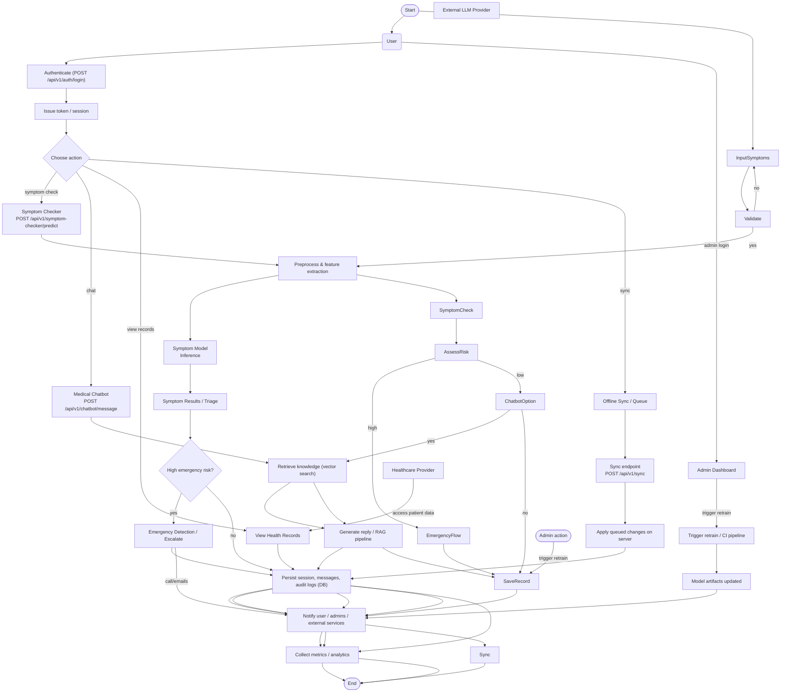

# Activity Diagram — AI Healthcare Assistant

This document contains an activity-style flowchart that shows the primary runtime flow for user interactions, symptom checking, chatbot retrieval, emergency escalation, and persistence.

Actors and mapping to components:

- User: mobile app — initiates symptom input and chat (see [readme/SympCheck.md](readme/SympCheck.md)).
- Backend: FastAPI — orchestrates inference, persistence, and escalation (see [readme/Backend.md](readme/Backend.md)).
- Chatbot & Retrieval: RAG pipeline (see [readme/Chatbot.md](readme/Chatbot.md)).
- Emergency Service: external escalation endpoint/phone/SMS.

How to use:

- Render this file in any Mermaid-capable viewer (VS Code, GitHub, Mermaid Live Editor).
- If you need a higher-fidelity UML activity diagram (e.g., for documentation PDFs), I can export a PNG/SVG and add it to the `readme/` folder.
