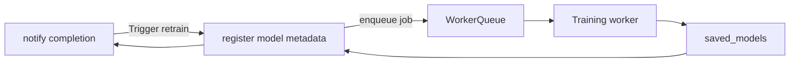

## Admin Dashboard — Comprehensive Guide

**Purpose & scope**

The Admin Dashboard is the central web interface and toolset for operators and developers to manage users, monitor system health, review flagged content, and perform maintenance tasks such as data correction and triggering model retraining. It combines administrative UI components with protected backend APIs.

In this project the dashboard is implemented under `admin_dashboard/` (Flutter web) and interacts with backend admin routes found under `backend/app/admin` and `backend/app/controllers`.

---

1) Key responsibilities

- User lifecycle management: list, view, update, deactivate, and seed admin users.
- Access control: manage roles and permissions for accounts.
- Monitoring and analytics: show system metrics (requests per minute, LLM usage, prediction rates), error logs, and health checks.
- Content moderation & audit: review flagged chatbot conversations, symptom-checker cases, and feedback.
- Model operations: trigger retraining, view model metadata, and promote model versions to production.

---

2) Architecture & files

- Frontend: `admin_dashboard/` — Flutter web UI (widgets, pages, assets)
- Backend APIs: `backend/app/admin/*` and `backend/app/controllers/*` — endpoints requiring admin RBAC
- Database: audit tables and admin action logs stored in the main DB (see `backend/app/models` and `backend/app/admin/models.py`)

---

3) Authentication & authorization

- Only users with the `admin` role can access the dashboard UI and APIs. The frontend includes a guard that checks the JWT `roles` claim and redirects non-admin users.
- Sensitive actions are double-confirmed (e.g., irreversible deletion) and recorded in the audit log with `performed_by`, `timestamp`, and `action_details`.

---

4) API endpoints (examples)

- `GET /api/v1/admin/users` — list users with pagination and filters
- `GET /api/v1/admin/users/{id}` — view user details and activity
- `POST /api/v1/admin/users/{id}/roles` — modify roles for a user
- `POST /api/v1/admin/retrain` — trigger model retraining (requires confirmation and may schedule a background job)
- `GET /api/v1/admin/metrics` — return aggregated metrics for dashboard charts

All admin endpoints are protected by auth middleware and RBAC checks.

---

5) UI components & behaviors

- User list page: searchable, filterable, with quick actions (suspend, reset password)
- Conversation review: timeline view with messages, retrieved sources, and labels; moderators can annotate and escalate.
- Model registry: view available model artifacts, metrics, and promote a model to `production` tag.
- System health: dependency checks (database, LLM provider status, worker queues) and quick restart or deploy links when applicable.

UX notes

- Use progressive disclosure for destructive actions; require reason text for audit entries when modifying user data.

---

6) Workflow diagrams

High-level admin action

```mermaid
flowchart TD
  AdminUI[Admin Dashboard] -->|Admin API call| BackendAdmin[Backend Admin API]
  BackendAdmin --> Auth[Auth Dependency (RBAC)]
  Auth -->|ok| Service[Admin Service Layer]
  Service --> DB[(Database)]
  Service --> Jobs[Background Jobs]
  Jobs --> ML[ai_models retrain]
  Service --> Logs[(Audit Log)]
```

Model retrain lifecycle



---

7) Data & audit

- Every admin action writes an audit record to `admin_action_logs` with fields: `id`, `admin_id`, `action`, `resource_type`, `resource_id`, `details`, `timestamp`.
- Conversation moderation stores reviewer notes and optionally redacts PII before export.

---

8) Monitoring & alerts

- Dashboard includes charts for: CPU/memory, request latency, LLM provider error rate, model performance drift indicators, and emergency event counts.
- Configure alerts (email/Slack) for high-severity issues: database down, model-serving errors, or sudden spike in emergency triage events.

---

9) Safety, privacy & compliance

- PII handling: Provide redaction tools in the moderator UI, avoid exporting raw PII. Keep exports limited and logged.
- Role separation: Admins have elevated privileges; developers or ops may have separate roles. Principle of least privilege applies.

---

10) Integration points & APIs to other modules

- Auth: uses `get_current_user` to validate admin role and retrieve admin identity.
- Chatbot: review flagged conversations and trigger actions such as session deletion or user warnings.
- Symptom Checker: view logs and flagged symptom submissions; correct data or mark ground-truth labels used for retraining.
- AI Models: trigger retraining, inspect model metrics, and promote models.

Programmatic export example

```json
POST /api/v1/admin/export
{
  "query": {"from":"2026-01-01","to":"2026-07-01"},
  "redact_pii": true
}
```

---

11) Operational procedures

- Seeding admin user: the repository includes `start_admin_dashboard.bat` and backend seeds in dev mode to create an initial admin user. This script should only be used in controlled environments.
- Backup & restores: administrators should validate DB backups and maintain a recovery playbook.

---

12) Testing & QA

- End-to-end tests: simulate an admin user performing common flows (role changes, retrain trigger).
- Security tests: ensure RBAC checks prevent unauthorized access; test audit logging for all privileged actions.

---

13) Troubleshooting & common issues

- UI can't authenticate: verify `api_config.dart` backend URL and that the JWT contains `admin` role.
- Missing audit logs: check DB connectivity and `admin_action_logs` retention policy.

---

14) Glossary (admin terms)

- Audit log: immutable record of administrative actions
- Promotion: marking a model artifact as production-ready in the registry
- Redaction: removing or masking PII from stored records

---

15) References & file links

- Admin UI: [admin_dashboard](admin_dashboard#L1)
- Backend admin APIs: [backend/app/admin](backend/app/admin#L1)
- Seeding script: [start_admin_dashboard.bat](start_admin_dashboard.bat#L1)
