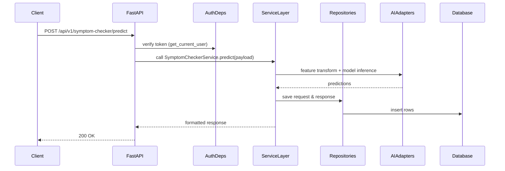

## Backend
## Backend — Full Technical Reference

This file documents the backend component of the AI Healthcare Assistant project. The backend is the central orchestration point for domain logic, data persistence, authentication, AI model inference, background jobs, and integration adapters.

High-level summary

- Framework: FastAPI (async-first Python web framework)
- Key responsibilities: request routing, input validation, authentication, business logic orchestration, persistence, model inference integration, background job scheduling
- Runtime options: `uvicorn` for dev, containerized via `docker-compose` for local multi-service stacks

---

1) Repository layout and notable packages

- `backend/app/` — primary application package
	- `api/` — API versioned routers and endpoint definitions
	- `auth/`, `authentication/` — auth models, token helpers, dependencies
	- `symptom_checker/` — service and endpoint adapter
	- `medical_chatbot/` — chatbot routers, services, repositories
	- `database/` — connection and session helpers
	- `models/` — SQLAlchemy ORM models and schemas
	- `core/` — settings, startup/shutdown logic, common utilities
	- `background_jobs/` — scheduled tasks and worker interfaces

- Dependency and run files
	- `pyproject.toml` / `requirements.txt` — Python deps
	- `Dockerfile` and `docker-compose.yml` — containerization for local dev

---

2) Architectural components & responsibilities

- HTTP layer: FastAPI routers handle request validation (Pydantic) and map to service calls.
- Service layer: domain-specific classes (SymptomCheckerService, ChatbotService) implement orchestration and call repositories.
- Repository layer: DB read/write operations and transaction handling.
- AI adapters: thin wrappers that call into `ai_models` artifacts or external LLM providers.
- Background workers: asynchronous jobs (Celery, RQ, or custom async workers) handle long-running tasks such as retraining, email, analytics batch jobs.

Design rationale

- Asynchronous I/O with FastAPI/uvicorn allows concurrency for many short-lived model/HTTP calls.
- Keep AI/ML heavy computation out of request thread when possible; use worker processes or gRPC microservices for heavy inference.

---

3) Request lifecycle (detailed)



Notes

- Input validation uses Pydantic models to ensure consistent API contracts and reduce downstream errors.
- Service calls should be small, deterministic, and testable — avoid side-effects within validation layers.

---

4) AI model integration patterns

Two main integration patterns are used:

- In-process inference: load lightweight models (e.g., scikit-learn/random-forest for symptom-checker) into process memory and call `predict_proba` directly. Suitable for low-latency, low-resource models.
- External provider / microservice: call external LLMs (OpenAI/Gemini) via HTTP; use adapters to implement retry/fallback and request shaping.

Best practices in this project

- Cache loaded in-process model objects at module level or service singleton to avoid reloads per request.
- Wrap external API calls with timeout and fallback strategies to avoid blocking user requests.

---

5) Background jobs & asynchronous tasks

- Use background jobs for:
	- Model retraining scheduling and heavy batch jobs
	- Sending email notifications or SMS
	- Periodic analytics aggregation and drift detection

- Recommended approach: use a task queue (Celery/RQ) connected to Redis and schedule tasks from API or admin actions. For this project, simple asyncio-based background tasks are used for small demos.

---

6) Database & migrations

- Uses SQLAlchemy models (declarative) and Alembic for migrations. Migrations should be applied during deployment.
- On development startup, a convenience auto-create block may run `Base.metadata.create_all` — be cautious in production.

---

7) Security considerations

- Input validation (Pydantic) reduces injection attack vectors.
- Authentication & RBAC applied consistently using dependencies.
- Sanitize and redact any PII before logging.
- Rate-limit expensive endpoints (LLM calls, retrain triggers).

---

8) Observability & monitoring

- Capture structured logs (JSON) with request id, user id, and model_version.
- Metrics to capture: request rate, error rate, request latency, model call latency, LLM provider errors, emergency triage events.
- Integrate APM (e.g., Prometheus + Grafana, Sentry) for error tracing and alerting.

---

9) Testing strategy

- Unit tests for services and repositories, with DB fixtures and mocked AI adapters.
- Integration tests using a test database (SQLite or test Postgres) and test client (FastAPI TestClient).
- Contract tests for API endpoints to ensure consistent behavior.

---

10) Troubleshooting common issues

- App fails to start: check environment variables and DB connectivity; run `backend/check_startup.py` for diagnostic checks if present.
- Model import errors: verify `ai_models` path and `sys.path` manipulations used in `symptom_checker/service.py` (avoid module-level sys.path modifications where possible).

---

11) Deploy & run notes (local dev)

Start backend locally (recommended via included script):

```powershell
.
# From project root
python -m venv .venv
.venv\Scripts\Activate.ps1
pip install -r backend/requirements.txt
cd backend
uvicorn app.main:app --reload --port 8000
```

Or use Docker Compose:

```powershell
docker-compose up --build
```

---

12) File links

- Main entry: [backend/app/main.py](backend/app/main.py#L1)
- Symptom service: [backend/app/symptom_checker/service.py](backend/app/symptom_checker/service.py#L1)
- Chatbot service: [backend/app/medical_chatbot/services/chatbot_service.py](backend/app/medical_chatbot/services/chatbot_service.py#L1)
