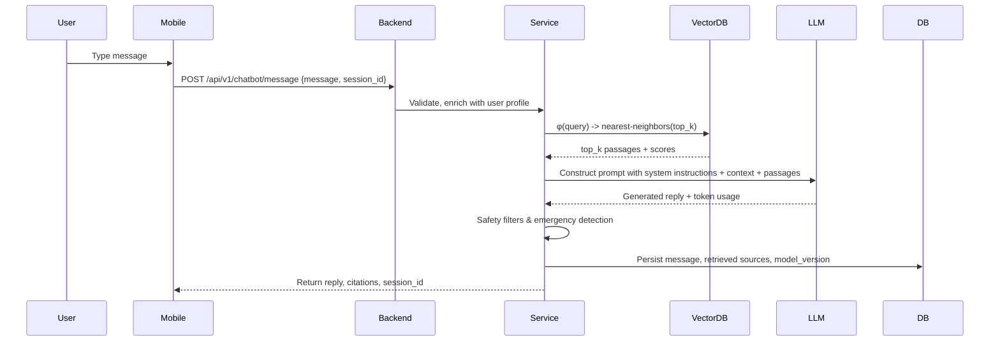

## Medical Chatbot — Detailed Technical Spec

**Purpose & Scope**

The Medical Chatbot provides interactive conversational assistance to end users and clinicians. It answers FAQs, provides contextual health education, detects emergencies, and escalates to human review when necessary. The module is organized to prioritize factuality, traceability, and safety over open-ended generation.

Key guarantees

- Cited evidence: every factual claim should be supported by retrieved documents when available.
- Safety-first: refuse, defer, or escalate when asked to diagnose or recommend treatments outside conservative guidance.
- Auditability: store conversation transcripts, retrieved sources, and model versions for later review.

---

1) Background & core theory

At a high level, the chatbot uses Retrieval-Augmented Generation (RAG). RAG is a two-step pipeline:

- Retrieval: map the user query and stored documents into a shared vector space using an embedding function φ(·); return top-k documents by nearest-neighbor search.
- Generation: use an LLM to produce a response conditioned on the retrieved documents and conversation context.

This approach reduces hallucinations by grounding generation in external documents and allows the system to cite sources.

The retrieval ranking for a query q and document d uses cosine similarity:

$$
\mathrm{score}(q,d) = \cos(φ(q), φ(d)) = \frac{φ(q) \cdot φ(d)}{||φ(q)||\;||φ(d)||}
$$

Normalized similarity scores can be used to weight retrieved passages in the prompt or to filter out low-relevance documents.

---

2) System components & repository layout

- Backend router: `backend/app/medical_chatbot/api/routes.py` — HTTP endpoints for message send, feedback, and session management.
- Service orchestrator: `backend/app/medical_chatbot/services/chatbot_service.py` — main orchestration layer.
- Repositories: `backend/app/medical_chatbot/repositories/*` — persistence for sessions, messages, feedback.
- Vector helpers: `ai_models/vector_database/*` — vector store, indexing, and retrieval utilities.
- Embeddings: `ai_models/embeddings/*` — embedding generation and model adapters.
- LLM adapters: `ai_models/llm/*` — wrappers for providers (OpenAI, Gemini) and prompt templates.

---

3) End-to-end request flow (detailed)



Sequence details

- Input validation: sanitize user input, strip PII unless designed to accept it, and normalize whitespace.
- Context windowing: include last N turns (by token budget) and the top-k retrieved passages when building the final prompt.
- Prompt engineering: use carefully designed system messages that instruct the LLM to cite sources, avoid definitive diagnoses, and ask clarifying questions when uncertain.

---

4) Retrieval & vector database

Vector store choices

- The repository contains simple vector store utilities; for production use, consider FAISS, Milvus, or Pinecone for scale.
- Indexing: store embeddings with metadata (document id, source, text, chunk offsets) and an approximate nearest neighbor index for performance.

Embedding pipeline

- Embeddings are generated using a model in `ai_models/embeddings` and stored alongside document metadata.
- Document chunking: long documents are chunked with overlap to maintain context and improve retrieval.

Ranking & scoring

- After retrieving top-k candidates by vector similarity, re-rank by combining similarity score and document recency/authority signals.
- Combine scores via weighted sum:

$$
score_{combined} = α \cdot cosine + β \cdot authority + γ \cdot freshness
$$

Where α, β, γ are tunable hyperparameters.

---

5) Prompting & LLM integration

Prompt structure

- System instruction (behavior constraints, safety mandates)
- Conversation history (last N turns)
- Retrieved evidence passages formatted as citations
- User query

Example snippet

```
System: You are a medical assistant. Use the evidence below and cite sources by id.
Context: [last user and assistant turns]
Evidence:
  [DOC_42] Fever and cough - source: disease_faqs.md
  [DOC_99] COVID guidance - source: gov_health.md
User: I have fever and cough, what should I do?
Assistant:
```

Provider adapters & fallback

- The project supports multiple LLM providers through adapters in `ai_models/llm`. The service should attempt the primary provider and fall back to a secondary provider if the call fails or exceeds latency thresholds.

Cost & latency management

- For production, cap token length, batch requests when possible, and cache frequent prompts (e.g., repeated FAQ answers).

---

6) Safety, verification & emergency handling

Safety layers

- Sanitization: remove PII and disallowed content before sending to third-party LLMs.
- Verification: if the LLM returns a statement with a high factual claim, ensure a retrieved passage supports it; otherwise, the assistant should hedge ("I may be mistaken") or ask to consult a provider.
- Emergency detection: any reply triggering an emergency must pass through `Emergency Detection` and, if confirmed, override normal flow to issue immediate triage recommendations.

Policy examples

- No medication prescription: refuse to provide step-by-step prescription instructions; provide general guidance and advise contacting professionals.
- Citation policy: include source ids for assertions; store these references in DB for auditing.

---

7) APIs and payloads

POST /api/v1/chatbot/message

Request

```json
{
  "session_id": "uuid",
  "message": "I have chest pain",
  "user_id": "uuid-or-null",
  "metadata": {"device":"android"}
}
```

Response

```json
{
  "reply": "Based on your symptoms, chest pain with shortness of breath is a red flag. Please seek emergency care.",
  "sources": [{"id":"DOC_23","title":"Chest pain triage"}],
  "session_id": "uuid",
  "model_version": "chatbot-v1.2",
  "tokens_used": 123
}
```

Feedback API

- `POST /api/v1/chatbot/feedback` to capture user feedback and ratings for replies; store for later training and evaluation.

---

8) Evaluation, metrics & monitoring

Core metrics

- Response relevance (human-rated)
- Citation fidelity (fraction of factual claims supported by retrieved sources)
- Emergency recall (sensitivity of emergency detection)
- Latency and uptime of LLM calls

Monitoring

- Track rate of hallucinations (user flags), average tokens per reply, and model provider errors.

---

9) Explainability & audit trail

- Persist per-turn evidence: retrieved passages, prompt used, LLM response, safety filter outputs, and final delivered reply.
- Provide admin tools to replay prompts and inspect model behavior for flagged conversations.

---

10) Integration with other modules

- Authentication: only authenticated users can access certain features; auth dependency provides user id for personalization and audit.
- Symptom Checker: the chatbot can call the Symptom Checker to obtain structured suggestions when users describe symptoms.
- Emergency Detection: both symptom checker and chatbot send candidate emergency flags to the Emergency Detection service for final decisioning.
- Admin Dashboard: review flagged conversations, user feedback, and retrain triggers.

---

11) Implementation best practices & deployment notes

- Cache embeddings and frequently requested retrieval results to reduce costs.
- Rate-limit user requests and apply backoff strategies when LLM provider errors occur.
- Rotate API keys and store them securely in environment variables.

---

12) Testing strategy

- Unit tests for retrieval pipeline and prompt formatting.
- Integration tests mocking LLM provider responses to validate safety filters and fallback logic.
- End-to-end tests validating session persistence and feedback ingestion.

---

13) Glossary (new terms)

- RAG: Retrieval-Augmented Generation — combining retrieval and generation.
- Embedding: vector representation of text used for semantic similarity.
- Vector DB: storage and index for embeddings with approximate nearest neighbor search.
- Citation Fidelity: measure of how often generated claims have supporting retrieved evidence.

---

14) Example troubleshooting scenarios

- Low relevance: increase chunk overlap during indexing or improve embedding model.
- Excessive hallucination: tighten prompt instruction, prefer retrieved evidence, and increase evidence token budget.

---

15) References & artifacts

- `CHATBOT_README.md` for high-level guidance
- `backend/app/medical_chatbot` for implementation
- `ai_models/embeddings` and `ai_models/vector_database` for retrieval helpers

