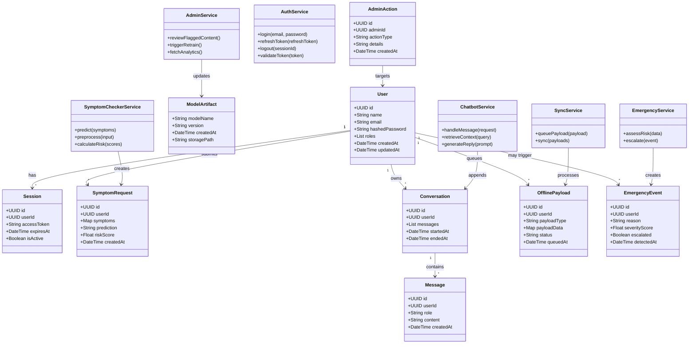

# Class Diagram — AI Healthcare Assistant

This file contains a high-level class diagram for the main components and data structures in the project, including authentication, symptom checker, chatbot, offline sync, admin operations, and persistence.

Notes:

- This is a conceptual class diagram; actual class names and field types may differ in implementation.
- Render in a Mermaid-capable viewer such as VS Code or GitHub.
