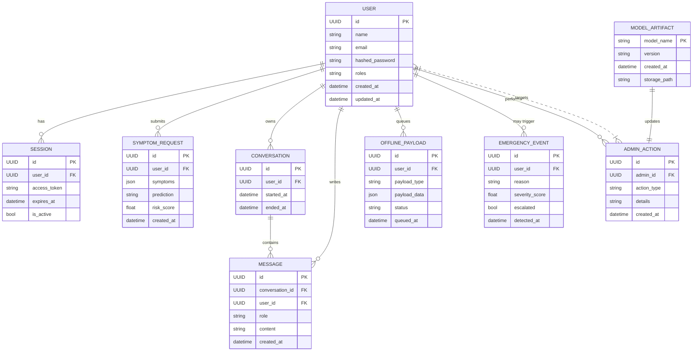

# ER Diagram — AI Healthcare Assistant

This file contains a high-level entity-relationship diagram for the main data entities in the project, including users, sessions, symptom requests, conversations, messages, offline sync payloads, emergency events, and admin actions.

Notes:

- This is a conceptual ER diagram; actual table and field names may vary in the implementation.
- Use a Mermaid-compatible viewer to render this diagram.
