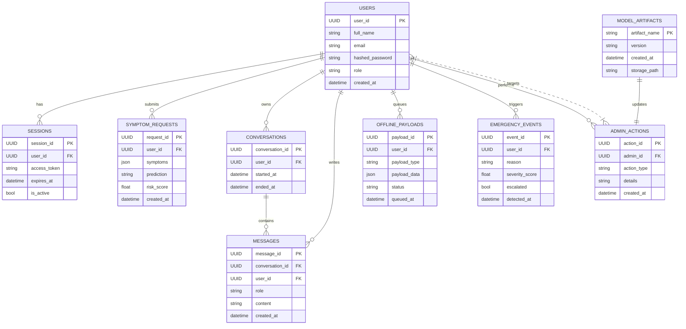

# ER Diagram — AI Healthcare Assistant

This file contains a high-level entity-relationship diagram for the main data entities in the project, written in a table-style layout.

Notes:

- This is a conceptual ER diagram; actual table and field names may differ in implementation.
- Render it with a Mermaid-compatible viewer.
