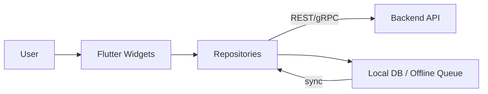

## Mobile App (Flutter) — Detailed Implementation

**Purpose & scope**

The mobile application is the primary user-facing client for the AI Healthcare Assistant. It collects user inputs (symptoms, chat messages), displays chatbot replies, shows triage results, handles authentication, and supports offline-first behavior for low-connectivity environments. The app is implemented in Flutter under `mobile_app/` and targets Android, iOS, and web (limited features on web).

---

1) Project layout & key files

- `mobile_app/lib/`: application source code
  - `lib/main.dart`: app entry point and dependency injection
  - `lib/screens/`: UI screens (symptom checker, chatbot, profile, admin when authorized)
  - `lib/repositories/`: network repositories (authentication_repository_impl.dart, chatbot_repository_impl.dart)
  - `lib/services/`: background sync, local storage adapters, network config
  - `lib/config/api_config.dart`: runtime API configuration (backend URL)
- `pubspec.yaml`: Flutter dependencies and assets

---

2) High-level architecture

The mobile app follows a layered architecture:

- Presentation: Flutter `Widgets` and UI state management (Provider / Riverpod / Bloc depending on repository usage)
- Domain: Repositories and services that implement app logic (auth, symptom flow, chatbot session management)
- Data: Network clients, local storage (SQLite / Hive), offline queue, and secure storage for secrets.

Interaction diagram



---

3) Authentication & token handling

- The app uses the backend JWT access + refresh token pair. Best practice: store refresh tokens in `flutter_secure_storage` and access token in memory or secure storage with short expiry.
- Known repo issue: `AuthenticationRepositoryImpl` previously stored tokens only in memory which caused logout on app restart. The fix is to persist tokens securely and load them on startup.

Token lifecycle recommendations

- On login: store `refresh_token` in secure storage, keep `access_token` in memory and refresh when near expiry.
- On app startup: read `refresh_token` and attempt refresh flow to obtain fresh access token. If refresh fails, navigate to login.

---

4) Symptom Checker UI flow

- Symptom selection: multi-select lists with severity sliders and optional free-text notes.
- Validation: ensure required fields and convert UI symptom codes to backend `symptom_code` values using a shared dictionary.
- Submission: assemble payload and call `POST /api/v1/symptom-checker/predict`.

UI snippet (behavioral)

- After receiving predictions, show top-3 conditions, triage badge (emergency/urgent/non-urgent), and recommended next steps.

---

5) Chatbot integration

- Chat UI supports streaming replies (if backend supports streaming) or batched replies. Each message turn is persisted locally for session continuity.
- When the chatbot returns `sources`, UI shows citation badges and a "View sources" panel that opens retrieved documents or summaries.

---

6) Offline-first & synchronization

Design rationale

- Users in the target environment may have intermittent connectivity. The app queues user actions locally and syncs opportunistically.

Local persistence

- Use a lightweight local DB (Sqflite or Hive) to store:
  - Offline queue: enqueued actions with idempotency token
  - Cached conversation history
  - Last-known model version and configuration

Sync algorithm (exponential backoff)

When connectivity returns, background sync consumes the queue and posts batched operations to `/api/v1/sync`. For retrying failed items, use exponential backoff with jitter:

$$
delay_k = \min(delay_{max}, base \cdot 2^{k}) + U[0, jitter]\
$$

Where `k` is the retry attempt count, `base` is initial delay (e.g., 1s), and `jitter` is random noise.

Conflict resolution

- Server authoritative IDs: server returns authoritative IDs for created resources; client replaces local-temp IDs.
- For updates, client uses `last_modified` timestamps and server-side last-write-wins policy, or requires manual conflict resolution via UI for critical data.

---

7) Data models & payload examples

Symptom example payload

```json
{
  "user_id":"...",
  "symptoms":[{"code":"S001","severity":2,"duration_hours":12}],
  "metadata":{"age":45,"sex":"male"}
}
```

Chat message payload

```json
{
  "session_id":"...",
  "message":"I have chest pain",
  "metadata":{"offline":false}
}
```

---

8) Performance & resource management

- Minimize background CPU: schedule sync tasks sparingly and respect battery saver policies.
- Cache images and avatars with a size limit and eviction policy.

---

9) Security & privacy on mobile

- Use `flutter_secure_storage` to store sensitive tokens and private data.
- Encrypt local DB where required for PII storage.
- Minimize PII in chat logs; redact or hash identifiers before sending telemetry.

---

10) Error handling & UX patterns

- Clear offline indicators and retry affordances.
- Show confidence and disclaimers for symptom-checker outputs.
- For emergency triage, prominently display an instruction to seek immediate care and provide local emergency numbers if available.

---

11) Testing strategy

- Unit tests for repositories (mock backend) and services (offline queue logic).
- Integration tests using Flutter integration_test to simulate flows across login, symptom submission, offline queueing, and sync.

---

12) Debugging & instrumentation

- Enable verbose logs in dev builds; log network requests, sync events, and token lifecycle events to a local dev log file.
- In production builds, only collect anonymized analytics and error traces (Sentry) with user consent.

---

13) Release & CI considerations

- Use `ci_cd/flutter.yml` for automated builds and tests. Sign artifacts per platform conventions (Play Store / Apple App Store) and keep keystore credentials secure.

---

14) Integration with project modules

- Backend: uses REST APIs documented in backend module files. Keep `api_config.dart` updated for runtime environment.
- Auth: must implement secure token storage and refresh flows; see `Auth.md` for server-side expectations.
- Offline: the app implements the client side of the `Offline` protocol and uses `POST /api/v1/sync` when available.

---

15) Glossary & new mobile-specific terms

- Offline queue: ordered list of locally stored operations awaiting server sync.
- Idempotency token: unique token used to identify retried requests to avoid duplicates.
- Secure storage: platform-provided encrypted storage for secrets.

---

16) References & file links

- App entry: [mobile_app/lib/main.dart](mobile_app/lib/main.dart#L1)
- Auth repo: [mobile_app/lib/repositories/authentication_repository_impl.dart](mobile_app/lib/repositories/authentication_repository_impl.dart#L1)
- API config: [mobile_app/lib/config/api_config.dart](mobile_app/lib/config/api_config.dart#L1)
