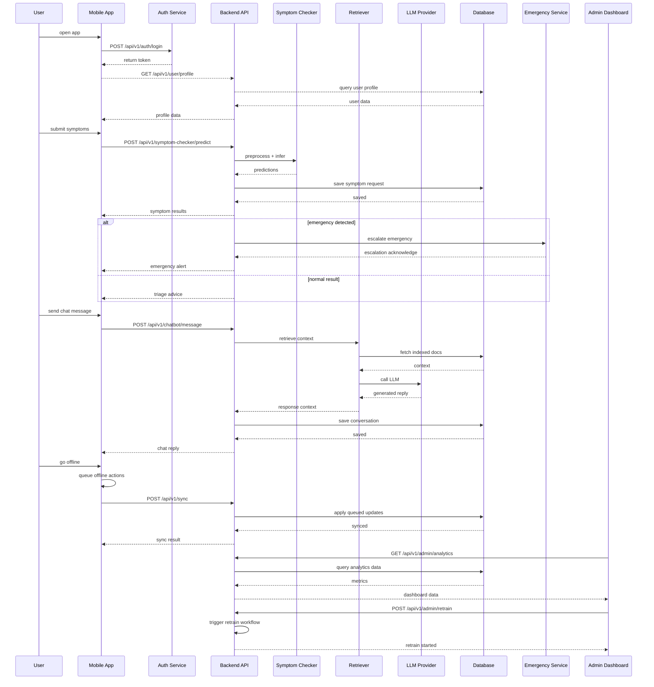

# Sequence Diagram — AI Healthcare Assistant

This document shows a project-wide sequence diagram in lifeline style, modeled after the requested layout.

Notes:

- Render this file in a Mermaid-capable viewer such as VS Code or GitHub.
- If the diagram still does not render, I can generate a fixed PNG/SVG version.
