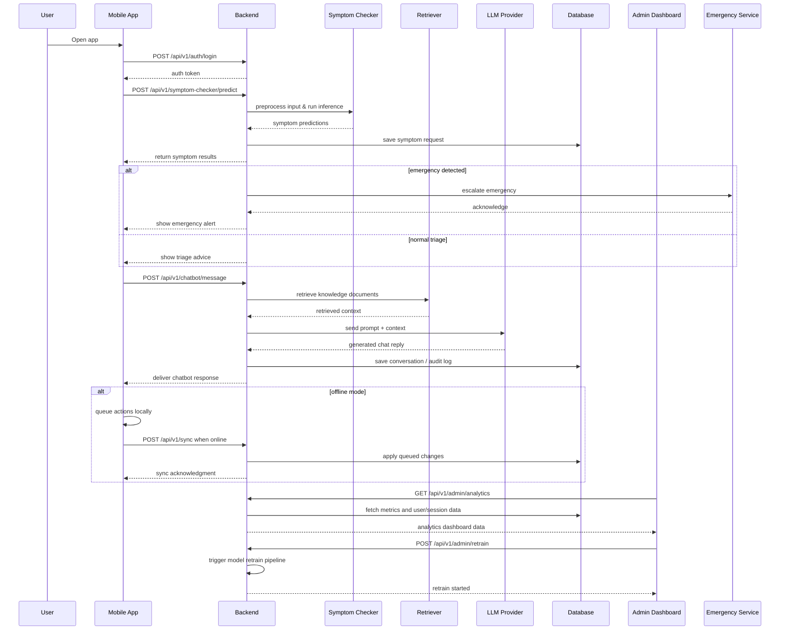

# Sequence Diagram — AI Healthcare Assistant

This document contains a project-wide sequence diagram for the main user flows: authentication, symptom checking, medical chatbot, emergency escalation, offline sync, admin reporting, and model retraining.

Notes:

- Use a Mermaid-compatible viewer like GitHub or VS Code to render this diagram.
- If this still fails, I can export a static PNG/SVG image instead of Mermaid text.
