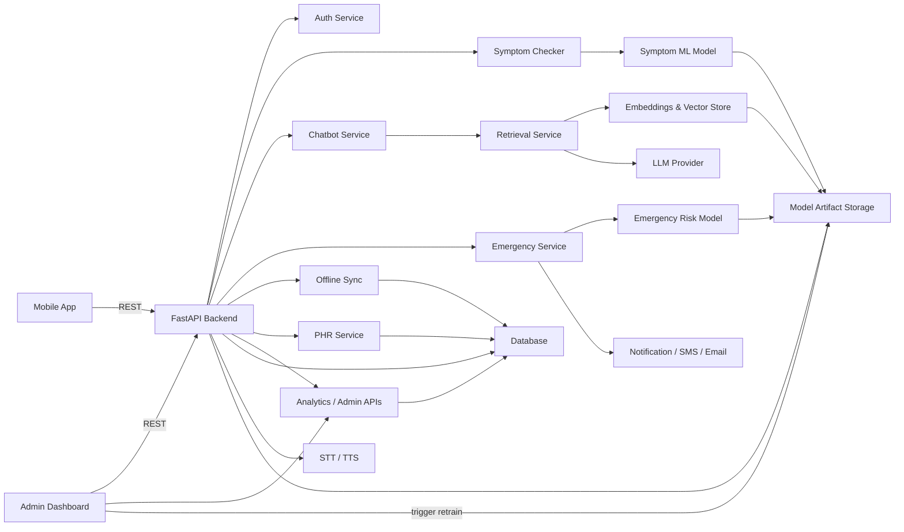

# System Architecture Diagram — AI Healthcare Assistant

This file contains a system architecture diagram showing the main components, data flow, and integrations across the mobile app, admin dashboard, backend, AI models, and external services.

Notes:

- This is a top-level system architecture diagram.
- Use a Mermaid-compatible renderer in VS Code or GitHub.
- It emphasizes the major components and how they connect.
