# Transition Diagram — AI Healthcare Assistant

This file shows state transitions across the system: user/session states, request-processing states, offline/sync states, admin/model states, and emergency escalation.

```mermaid
flowchart LR
  %% Transition-style flow using flowchart for maximum compatibility
  Unauth["Unauthenticated"]
  Auth["Authenticated"]
  Idle["Idle / Home"]
  InSymptom["In Symptom Checker"]
  InChat["In Chat Session"]
  Retrieving["Retrieving Knowledge"]
  WaitingLLM["Waiting for LLM Response"]
  ShowingResult["Showing Result / Reply"]
  EmergencyEsc["Emergency Escalated"]
  OfflineQ["Offline - Queued Actions"]
  Syncing["Syncing with Server"]
  AdminReview["Admin Review"]
  Retrain["Model Retraining"]
  ErrorState["Error / Retry"]

  Unauth -->|login success| Auth
  Auth --> Idle
  Idle -->|start symptom check| InSymptom
  Idle -->|open chat| InChat
  InSymptom -->|submit| Retrieving
  InChat -->|send message| Retrieving
  Retrieving -->|found| WaitingLLM
  WaitingLLM -->|response| ShowingResult
  ShowingResult --> Idle
  Retrieving -->|no network| OfflineQ
  OfflineQ -->|network back| Syncing --> Retrieving
  Retrieving -->|detect emergency| EmergencyEsc
  EmergencyEsc -->|notify & escalate| ShowingResult
  AnyError(Error) -.->|retry| ErrorState
  ErrorState --> Retrieving

  %% Admin / model lifecycle transitions
  Auth -->|admin login| AdminReview
  AdminReview -->|approve retrain| Retrain
  Retrain -->|new model| Idle

  %% Logout path
  Auth -->|logout| Unauth

  %% Rough legend
  classDef states fill:#f9f,stroke:#333,stroke-width:1px;
  class Unauth,Auth,Idle,InSymptom,InChat,Retrieving,WaitingLLM,ShowingResult,EmergencyEsc,OfflineQ,Syncing,AdminReview,Retrain,ErrorState states;
```

Notes:

- This uses simple flowchart nodes to emulate state transitions for wide Mermaid compatibility.
- If you prefer a strict UML state diagram, I can create an SVG/PDF export using a rendering tool and add it to `readme/`.
